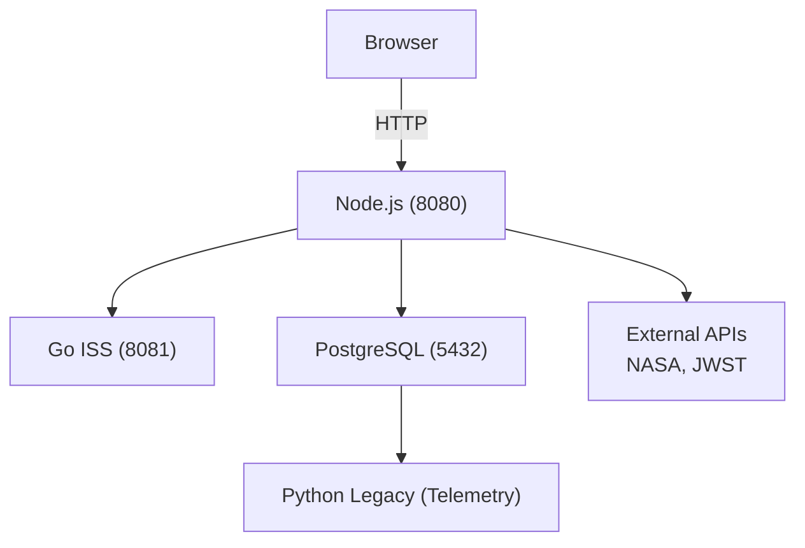

### **Описание проекта**

Распределенная система мониторинга космических данных "Кассиопея", состоящая из нескольких микросервисов:

- **`go_iss`**
  Go-сервис для сбора данных о МКС и космических миссиях
- **`node_web`** 
  Node.js/Express веб-приложение с дашбордами и галереями изображений JWST
- **`python_legacy`**
  Сервис генерации телеметрии
- **`iss_db`**
  PostgreSQL база данных
### **Технологический стек**

| Сервис | Язык/Фреймворк | База данных | Порт |
|--------|----------------|-------------|------|
| go_iss | Go 1.23 + Gin | PostgreSQL | 8081 |
| node_web | Node.js + Express | PostgreSQL | 8080 |
| python_legacy | Python 3.11 | PostgreSQL | - |
### **История миграций стека**

Проект прошёл полную миграцию технологического стека:

| Старый стек   | Новый стек        |
| ------------- | ----------------- |
| Rust + Axum   | Go + Gin          |
| PHP + Laravel | Node.js + Express |
| Pascal        | Python 3.11       |

Старые сервисы (Rust, PHP, Pascal) удалены из активной разработки. Текущий стек полностью модернизирован.`
### **Быстрый старт**

#### **Предварительные требования**

- Docker и Docker Compose
- Порты 8080, 8081, 5432 должны быть свободны
#### **Запуск проекта**

```bash
# Клонировать репозиторий
git clone https://github.com/angelomira/RefactoringMonolith4.git
cd RefactoringMonolith4

# Запустить все сервисы
docker compose up --build
# Или в фоновом режиме
docker compose up --build -d
```
#### **Проверка работоспособности**

После запуска сервисы будут доступны:

- **Веб-интерфейс (Node.js)**:
  http://localhost:8080/dashboard
- **Go API**:
  http://localhost:8081/health
- **PostgreSQL**: 
  `localhost:5432`
### **Примеры запросов**

```bash
# Проверка здоровья Node.js веб-сервиса
curl http://localhost:8080/health
# Проверка здоровья Go-сервиса
curl http://localhost:8081/health
# Получить последнюю позицию МКС
curl http://localhost:8081/last
# Получить тренд движения МКС
curl http://localhost:8081/iss/trend
# Синхронизировать данные OSDR
curl http://localhost:8081/osdr/sync
# Получить сводку всех космических данных
curl http://localhost:8081/space/summary
# Обновить кэш космических данных
curl "http://localhost:8081/space/refresh?src=apod,neo,flr,cme,spacex"
```
### **Архитектура**

#### **Схема взаимодействий**


### **API-эндпоинты**

#### **Node.js веб-сервиса (порт 8080)**

| Endpoint | Method | Описание |
|----------|--------|----------|
| `/health` | GET | Проверка здоровья сервиса |
| `/dashboard` | GET | Главная страница с дашбордом |
| `/osdr` | GET | Страница датасетов OSDR |
| `/page/:slug` | GET | CMS страница |
| `/api/iss/last` | GET | Прокси к go_iss /last |
| `/api/iss/trend` | GET | Прокси к go_iss /iss/trend |
| `/api/jwst/feed` | GET | JWST галерея изображений |
| `/api/astro/events` | GET | Астрономические события |
#### **Go-сервиса (порт 8081)**

| Endpoint | Method | Описание |
|----------|--------|----------|
| `/health` | GET | Проверка здоровья сервиса |
| `/last` | GET | Последняя позиция МКС |
| `/fetch` | GET | Триггер обновления позиции МКС |
| `/iss/trend` | GET | Анализ движения МКС |
| `/osdr/sync` | GET | Синхронизация данных OSDR |
| `/osdr/list` | GET | Список датасетов OSDR |
| `/space/:src/latest` | GET | Последние данные по источнику |
| `/space/refresh` | GET | Обновить кэш источников |
| `/space/summary` | GET | Сводка всех данных |
### **Конфигурация**

#### **Переменные окружения**

##### **Node.js веб-сервис**

```ruby
PORT=3000
GO_ISS_BASE=http://go_iss:3000
JWST_HOST=https://api.jwstapi.com
JWST_API_KEY=your_key
ASTRO_APP_ID=your_app_id
ASTRO_APP_SECRET=your_secret
DB_HOST=db
DB_PORT=5432
DB_DATABASE=monolith
DB_USERNAME=monouser
DB_PASSWORD=monopass
```
#### **Go-сервис**

```ruby
DATABASE_URL=postgres://monouser:monopass@db:5432/monolith
NASA_API_URL=https://visualization.osdr.nasa.gov/biodata/api/v2/datasets/?format=json
NASA_API_KEY=your_api_key
WHERE_ISS_URL=https://api.wheretheiss.at/v1/satellites/25544
FETCH_EVERY_SECONDS=600
```
#### **Python-legacy сервис**

```ruby
CSV_OUT_DIR=/data/csv
GEN_PERIOD_SEC=300
PGHOST=db
PGPORT=5432
PGUSER=monouser
PGPASSWORD=monopass
PGDATABASE=monolith
```

### **Тестирование**

#### **Go-сервис**

```bash
cd services/go-iss
go test ./...
go vet ./...
```
#### **Node.js веб-сервис**

```bash
cd services/node-web
npm install
npm test
npm run lint
```
#### **Python-legacy сервис**

```bash
cd services/pascal-legacy
python3 -m pytest  # если есть тесты
flake8 legacy.py
```
### **Структура базы данных**
#### **Таблицы**

**`iss_fetch_log`** - логи позиций МКС

```sql
CREATE TABLE iss_fetch_log (
    id BIGSERIAL PRIMARY KEY,
    fetched_at TIMESTAMPTZ NOT NULL DEFAULT now(),
    source_url TEXT NOT NULL,
    payload JSONB NOT NULL
);
```

**`osdr_items`** - датасеты NASA OSDR

```sql
CREATE TABLE osdr_items (
    id BIGSERIAL PRIMARY KEY,
    dataset_id TEXT UNIQUE,
    title TEXT,
    status TEXT,
    updated_at TIMESTAMPTZ,
    inserted_at TIMESTAMPTZ NOT NULL DEFAULT now(),
    raw JSONB NOT NULL
);
```

**`space_cache`** - кэш космических данных

```sql
CREATE TABLE space_cache (
    id BIGSERIAL PRIMARY KEY,
    source TEXT NOT NULL,
    fetched_at TIMESTAMPTZ NOT NULL DEFAULT now(),
    payload JSONB NOT NULL
);
```

**`telemetry_legacy`** - телеметрия от legacy-сервиса

```sql
CREATE TABLE telemetry_legacy (
    id BIGSERIAL PRIMARY KEY,
    recorded_at TIMESTAMPTZ NOT NULL,
    voltage NUMERIC(6,2) NOT NULL,
    temp NUMERIC(6,2) NOT NULL,
    source_file TEXT NOT NULL
);
```
### **Безопасность**

1) Секреты вынесены в `.env`
2) Защита от SQL-инъекций через параметризованные запросы (pgx)
3) Таймауты для внешних API (30 секунд)
4) User-Agent для предотвращения блокировок
5) Санитизация входных данных
### **Документация и отчёты**

#### **Отчёты**

- [**REPORT_GENERAL.md**](REPORT_GENERAL.md) - описание проекта, процесс выполнения, инструкция по запуску и проверке;
- [**REPORT_TECHNICAL.md**](REPORT_TECHNICAL.md) - детальный анализ кода, паттерны, архитектура, примеры;
#### **Инструкции**

- [RUNNING.md](RUNNING.md) - пошаговая инструкция для запуска;
- [REFACTORING_TABLE.md](REFACTORING_TABLE.md) - таблица изменений: модуль → проблема → решение → паттерн;
#### **Безопасность**

- [SECURITY.md](SECURITY.md) - анализ безопасности проекта
### Документация сервисов

- [services/go-iss/README.md](services/go-iss/README.md) - Документация Go ISS-сервиса
- [services/node-web/README.md](services/node-web/README.md) - Документация Node.js веб-сервиса
- [services/pascal-legacy/README.md](services/pascal-legacy/README.md) - Документация Python legacy-сервиса
