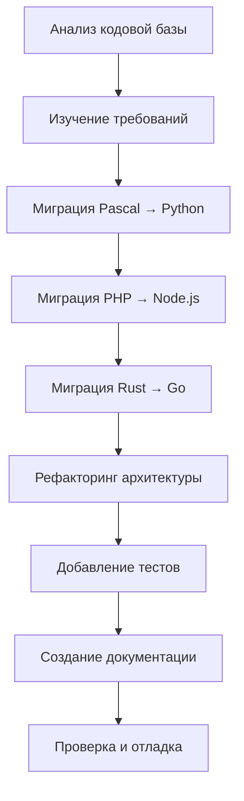

| Параметр                | Значение                                |
| ----------------------- | --------------------------------------- |
| **Проект**              | Кассиопея                               |
| **Практическая работа** | №4 — Рефакторинг распределённой системы |
## (1). Описание задачи

### (1.1). Исходное состояние

Компания "Кассиопея" предоставила распределённую систему мониторинга космических данных, которая включала:

- **Rust-сервис** (`rust_iss`)
  сбор данных о МКС и космических миссиях
- **PHP/Laravel веб-приложение** (`php_web`)
  дашборды и галереи
- **Pascal легаси-сервис** (`pascal_legacy`)
  генерация телеметрии
- **PostgreSQL**
  основная база данных
- **Nginx**
  reverse-proxy

### (1.2). Выявленные проблемы

1. **Монолитная архитектура** - код разбросан без чёткой структуры
2. **Устаревший стек технологий** - Pascal, сложный PHP стек с nginx
3. **Отсутствие единого формата ошибок** - разные сервисы возвращают ошибки по-разному
4. **Нет тестов** - отсутствует покрытие тестами
5. **Нет документации** - нет инструкций по запуску и проверке
6. **Возможные дубликаты в БД** - слепые INSERT без проверки
### (1.3). Поставленные цели

1. Привести архитектуру в корректное состояние
2. Ввести единые практики ошибок, логов и тестов
3. Сохранить бизнес-функциональность
4. Выполнить миграцию на современный стек технологий
5. Создать полную документацию
## (2). Планирование и процесс выполнения

### (2.1). Этапы работы



### (2.2). Хронология выполнения

| Этап | Описание                                | Результат                                                                  |
| ---- | --------------------------------------- | -------------------------------------------------------------------------- |
| 1    | Анализ исходного кода и требований PDF  | Определены проблемы и план действий                                        |
| 2    | Миграция Pascal → Python                | `legacy.py` на Python 3.11                                                 |
| 3    | Миграция PHP/Laravel → Node\.js/Express | node-web на Express + EJS                                                  |
| 4    | Миграция Rust → Go                      | go-iss на Gin + pgx                                                        |
| 5    | Внедрение Clean Architecture            | 8 слоёв: config, domain, repo, clients, services, handlers, routes, errors |
| 6    | Унификация ошибок                       | Единый формат `{"ok": false, "error": {...}}`                              |
| 7    | Документация                            | 6+ файлов документации                                                     |
| 8    | CI/CD                                   | GitHub Actions для всех сервисов                                           |
## (3). Миграции технологий

### (3.1). Сводная таблица миграций

| Было | Стало | Обоснование |
|------|-------|-------------|
| **Rust + Axum** | **Go + Gin** | Проще синтаксис, быстрее компиляция, единый бинарник |
| **PHP/Laravel + nginx** | **Node.js + Express** | Единый JS-стек, меньше контейнеров, async/await |
| **Pascal (Free Pascal)** | **Python 3.11** | Широкая экосистема, проще поддержка, современный язык |

Преимущества выбора:

- **Единообразие** — все сервисы используют схожие паттерны
- **Простота** — меньше контейнеров и зависимостей, знакомство со стеком
## (4). Инструкция по запуску проекта

### (4.1). Предварительные требования

- Docker 20.10+, Docker Compose 2.0+
- Свободные порты: 8080, 8081, 5432
### (4.2). Быстрый запуск

```bash
git clone https://github.com/angelomira/RefactoringMonolith4.git
cd RefactoringMonolith4

docker compose up --build

# Или в фоновом режиме
# docker compose up --build -d
```

### (4.3). Проверка работоспособности

После запуска (2-5 минут на сборку):

```bash
# Проверка Node.js веб-сервиса
curl http://localhost:8080/health
# Ожидаемый ответ: {"status":"ok","service":"node-web",...}

# Проверка Go ISS API
curl http://localhost:8081/health
# Ожидаемый ответ: {"status":"ok","now":"2024-..."}

# Открыть веб-интерфейс
# http://localhost:8080/dashboard
```

### (4.4). Остановка сервисов

```bash
# Остановить сервисы
docker compose down

# Остановить и удалить данные
docker compose down -v
```
## (5.) Проверка

### (5.1). Чеклист функциональности

| №   | Проверка             | Команда/URL                                                    | Ожидаемый результат      |
| --- | -------------------- | -------------------------------------------------------------- | ------------------------ |
| 1   | Health check Node.js | `curl http://localhost:8080/health`                            | JSON с status="ok"       |
| 2   | Health check Go      | `curl http://localhost:8081/health`                            | JSON с status="ok"       |
| 3   | Веб-дашборд          | `http://localhost:8080/dashboard`                              | Страница с картой МКС    |
| 4   | API МКС              | `curl http://localhost:8081/last`                              | JSON с позицией МКС      |
| 5   | Тренд МКС            | `curl http://localhost:8081/iss/trend`                         | JSON с анализом движения |
| 6   | OSDR данные          | `curl http://localhost:8081/osdr/list`                         | Список датасетов         |
| 7   | Космические данные   | `curl http://localhost:8081/space/summary`                     | Сводка всех данных       |
| 8   | База данных          | `docker compose exec db psql -U monouser -d monolith -c "\dt"` | Список таблиц            |
| 9   | Логи legacy          | `docker compose logs python_legacy`                            | Логи генерации CSV       |
| 10  | Телеметрия в БД      | SQL: `SELECT * FROM telemetry_legacy LIMIT 5;`                 | Записи телеметрии        |
### (5.2). Проверка архитектурных изменений

```bash
# Структура Go-сервиса (мигрирован с Rust)
ls -la services/go-iss/internal/
# Должны быть: config, domain, repo, clients, services, handlers

# Структура Node.js-сервиса (мигрирован с PHP)
ls -la services/node-web/
# Должны быть: server.js, views/, package.json

# Структура Python-сервиса (мигрирован с Pascal)
ls -la services/pascal-legacy/
# Должны быть: legacy.py, Dockerfile, README.md
```
### (5.3). Проверка единого формата ошибок

```bash
# Запрос несуществующего ресурса
curl http://localhost:8081/space/invalid/latest | jq

# Ожидаемый формат:
# {"ok":true,"source":"invalid","message":"no data"}
# или
# {"ok":false,"error":{"code":"...","message":"..."}}
```
### (5.4). Проверка защиты от дубликатов (Upsert)

```bash
# Выполнить синхронизацию дважды
curl http://localhost:8081/osdr/sync
curl http://localhost:8081/osdr/sync

# Проверить отсутствие дубликатов
docker compose exec db psql -U monouser -d monolith -c \
  "SELECT dataset_id, COUNT(*) FROM osdr_items WHERE dataset_id IS NOT NULL GROUP BY dataset_id HAVING COUNT(*) > 1;"

# Ожидаемый результат: пустой (0 rows)
```